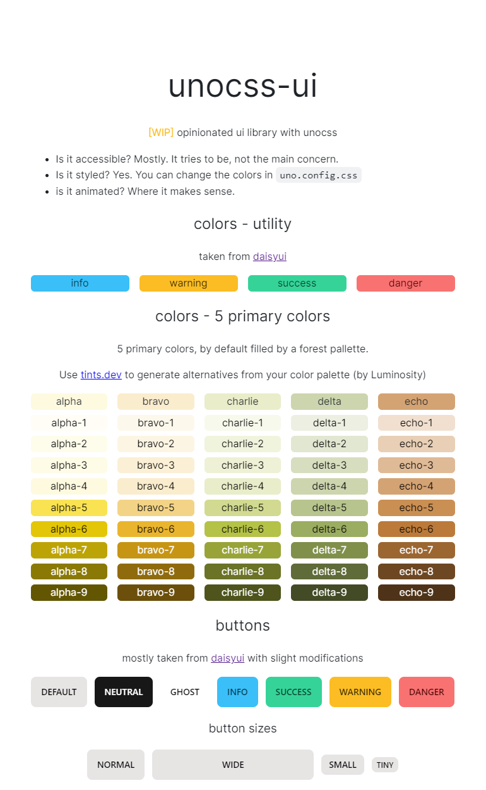

# unocss-ui
- work-in-progress opinionated ui library with unocss
- takes a lot of inspiration from daisy-ui
- uses svelte to showcase the library
- most components are unocss-only (framework agnostic utility-classes)
  - more advanced components will be only implemented in svelte
  

